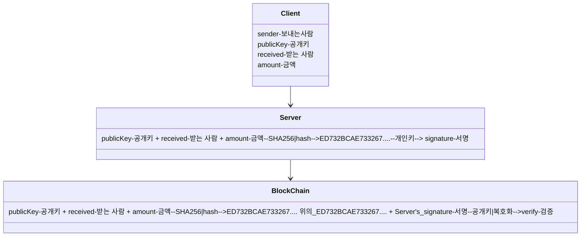

# 지갑 서버

오늘 13시 국취제 상담사 전화하기 !

- 왜 서버를 따로 만드는 이유
  - 보안, 아무나 블록체인에 블록이나 트랜잭션을 추가할 수 없도록 하기 위해서 중간 단계에서 서버를 통한다

```mermaid
    classDiagram
    Client-->Server
    Server-->BlockChain
    class Client{
        sender-보내는사람
        publicKey-공개키
        received-받는 사람
        amount-금액
    }
    class Server{
        publicKey-공개키 + received-받는 사람 + amount-금액--SHA256|hash-->ED732BCAE733267....--개인키--> signature-서명
    }
    class BlockChain{
         publicKey-공개키 + received-받는 사람 + amount-금액--SHA256|hash-->ED732BCAE733267.... 위의_ED732BCAE733267.... + Server's_signature-서명--공개키|복호화-->verify-검증
    }
```
